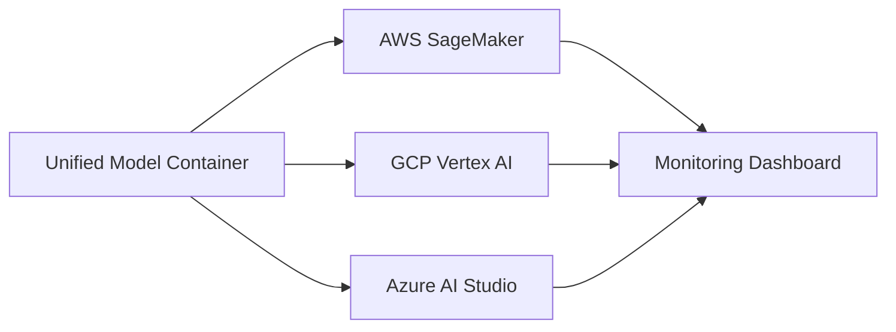

# Multi-Cloud AI Deployment Strategy

## 1. Introduction
Organizations often deploy AI across multiple cloud platforms to optimize cost and performance. This project demonstrates the deployment of the same machine learning model across **AWS**, **GCP**, and **Azure** to analyze trade-offs.

## 2. Objectives
*   **Compare Cloud AI Platforms:** Evaluate the ease of deployment and management across different vendors.
*   **Analyze Cost & Performance:** Benchmark latency and operational costs to make informed deployment decisions.

## 3. Problem Statement
Vendor lock-in and inconsistent performance across providers are significant challenges in single-cloud deployments. Multi-cloud strategies help mitigate these risks.

## 4. Requirements
*   **AWS:** SageMaker
*   **GCP:** Vertex AI
*   **Azure:** Azure AI Studio / Machine Learning Service
*   **Tools:** Docker, Python, FastAPI, Streamlit

## 5. System Architecture

*   **Unified Model:** A standardized containerized model.
*   **Deployment Pipelines:** Cloud-specific automation scripts.
*   **Monitoring Dashboard:** A central view for performance and cost metrics.

## 6. Methodology
1.  **Standardize Model Container:** Package the model using Docker and FastAPI.
2.  **Deploy on Each Cloud:** Use SDKs (Boto3, Google Cloud AI Platform, Azure ML SDK) to deploy the container.
3.  **Measure Metrics:** Send test requests and log response times and billing data.

## 7. System Testing
*   **Cross-cloud latency tests:** Comparative analysis of response times.
*   **Cost benchmarking:** Estimated cost per 1,000 requests across providers.

## 8. Results and Discussion
Different clouds show varying strengths in latency, ease of deployment, and cost-effectiveness. This project enables data-driven decisions for production AI scaling.
