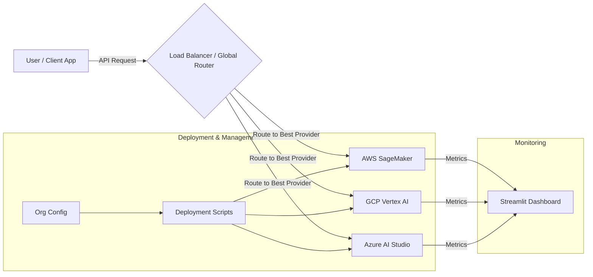

# Multi-Cloud AI Deployment Strategy 🚀

A comprehensive MLOps framework for deploying, managing, and comparing AI models across **AWS (SageMaker)**, **GCP (Vertex AI)**, and **Azure (AI Studio)**.

This project enables organizations to avoid vendor lock-in, optimize for cost/performance, and maintain high availability across multiple cloud providers and organizational environments.

---

## 🌟 Key Features

*   **Multi-Cloud Agnostic:** Standardized model container that runs seamlessly on AWS, GCP, and Azure.
*   **Multi-Organization Support:** Manage deployments for different clients or environments (e.g., Client A vs. Internal Dev) using a single configuration file.
*   **Cost & Performance Benchmarking:** Real-time dashboard to compare latency and estimated costs across providers.
*   **Automated Deployment Pipelines:** Python scripts using cloud SDKs to automate model registration and endpoint creation.
*   **Monitoring Dashboard:** Interactive Streamlit app for visualizing cross-cloud metrics.

---

## 📂 Project Structure

```bash
.
├── config/
│   └── org_config.json       # Configuration for multiple organizations (Roles, Project IDs)
├── deploy/
│   ├── aws_deploy.py         # AWS SageMaker deployment script
│   ├── gcp_deploy.py         # GCP Vertex AI deployment script
│   └── azure_deploy.py       # Azure Machine Learning deployment script
├── model/
│   ├── main.py               # FastAPI model inference server
│   └── Dockerfile            # Container definition
├── monitor/
│   ├── benchmark.py          # Script to generate performance metrics
│   └── dashboard.py          # Streamlit dashboard for visualization
├── requirements.txt          # Python dependencies
└── README.md                 # Project documentation
```

---

## ⚙️ Setup & Installation

1.  **Clone the repository:**
    ```bash
    git clone https://github.com/your-repo/multi-cloud-ai-strategy.git
    cd multi-cloud-ai-strategy
    ```

2.  **Install Dependencies:**
    ```bash
    pip install -r requirements.txt
    ```

3.  **Configure Organizations:**
    Edit `config/org_config.json` to add your specific cloud credentials (Role ARNs, Project IDs, Subscription IDs).
    ```json
    {
        "organizations": {
            "client_a": {
                "description": "Client A Production",
                "aws": { "role_arn": "arn:aws:iam::..." },
                "gcp": { "project_id": "client-a-prod" },
                ...
            }
        }
    }
    ```

---

## 🚀 Usage Guide

### 1. Local Simulation (Testing)
Run the entire stack locally to verify the flow before deploying to the cloud.

*   **Start the Model Server:**
    ```bash
    python model/main.py
    ```
*   **Run Benchmarks:**
    This generates `benchmark_results.csv` with simulated data.
    ```bash
    python monitor/benchmark.py
    ```
*   **Launch Dashboard:**
    View the interactive metrics.
    ```bash
    streamlit run monitor/dashboard.py
    ```

### 2. Cloud Deployment
Deploy the model to a specific cloud provider for a specific organization.

*   **AWS SageMaker:**
    ```bash
    python deploy/aws_deploy.py --org=org_client_a
    ```
*   **GCP Vertex AI:**
    ```bash
    python deploy/gcp_deploy.py --org=org_internal
    ```
*   **Azure AI Studio:**
    ```bash
    python deploy/azure_deploy.py --org=default
    ```

> **Note:** Ensure you have the respective Cloud CLI installed and authenticated (`aws configure`, `gcloud auth login`, `az login`) before running deployment scripts.

---

## 🏗️ System Architecture



---

## 🔮 Future Roadmap
*   **Infrastructure as Code (IaC):** Migrate Python scripts to Terraform for state-managed infrastructure.
*   **Global Load Balancer:** Implement intelligent traffic routing based on real-time latency checks.
*   **Automated Failover:** Logic to automatically switch providers if error rates spike.

---

